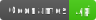
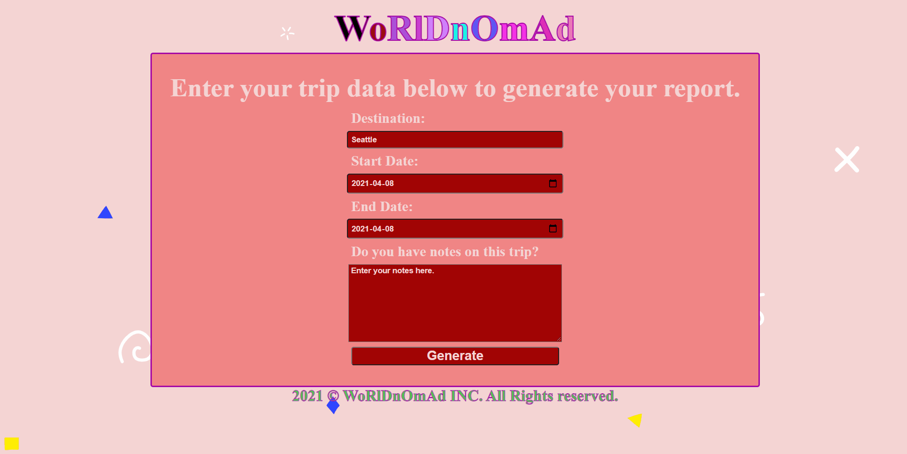

# WoRlDnOmAd Travel Planner 🗺️🛩️🌄





</br>
The herein repository host the necessary assets for a travel planner called "WoRlDnOmAd." It consists of an application enabling users to plan a trip by asking them to input the name of their destination, the start and end date of their trip. The web application ingests the user data to output geographic data, weather data, and a pretty picture of the supposed trip.

## Table of Content

1. [Design](#Design)
2. [Instructions](#Instructions)
   1. [Download repository files](#Download-repository-files)
   2. [Setup environment](#Setup-environment)
   3. [Add modules to setup server](#Add-module-to-setup-server)
   4. [Conduct npm audit](#Conduct-npm-audit)
   5. [Add 'dotenv' module](#Add-'dotenv'-module)
   6. [Add a build npm script](#Add-a-build-npm-script')
   7. [Add testing via 'Jest' for unit-testing](#Add-testing-via-'Jest'-for-unit-testing)
   8. [Install 'node-fetch'](#Install-'node-fetch')
   9. [Add moment.js](#Add-moment.js)
   10. [Add the static module bundler, namely 'Webpack'](#Add-the-static-module-bundler,-namely-'Webpack')
   11. [Install 'webpack-dev-server'](#Install-'webpack-dev-server')
   12. [Install 'Babel'](#Install-'Babel')
   13. [Install 'HtmlWebPackPlugin'](#Install-'HtmlWebPackPlugin')
   14. [Install 'CleanWebpackPlugin'](#Install-'CleanWebpackPlugin')
   15. [Install 'style-loader'](#Install-'style-loader')
   16. [Install 'file-loader'](#Install-'file-loader')
   17. [Install mini-css-extract-plugin](#Install-'mini-css-extract-plugin')
   18. [Install 'terser-webpack-plugin'](#Install-'terser-webpack-plugin')
   19. [Install Optimize CSS Assets Webpack Plugin](#Install-Optimize-CSS-Assets-Webpack-Plugin)
   20. [To reset user defaults](#To-reset-user-defaults)
   21. [Add 'serviceWorker'](#Add-'serviceWorker')
   22. [Add NeDB module](#Add-NeDB-module)
   23. [Add 'punycode'](#Add-'punycode')
   24. [List of all needed npm commands](#List-of-all-needed-npm-commands)
3. [Fetch Api keys](#Fetch-Api-keys)
4. [Examples](#Examples)
5. [Tools](#Tools)
6. [License](#License)

## Design

The web application prompts the user to enter the start date and end date of their trip. They also must enter their desired destination subsequently, and they can also input notes. Using chained promises, the destination is sent to the GeoNames API, where the country and coordinates are obtained for the given destination. Using those coordinates, weather data is generated for each day at that destination. The application assumes that the trip's duration excludes the time needed to get to and leave the destination. Using the obtained city name and country name, a picture related to the destination is obtained. The generated data from the server-side is stored locally using NeDB.

## Instructions

### Download repository files

To have access to the assets necessary for the project, you may download the 'zip file' directly from the herein repository. Otherwise, you can clone the repository by using Git (<https://github.com/aimogue/NLP-Article-Analyzer-Web-Tool.git>), SSH (git@github.com:aimogue/NLP-Article-Analyzer-Web-Tool.git) Github CLI (gh repo clone aimogue/NLP-Article-Analyzer-Web-Tool) or Github Desktop. For more information on to clone a repository, please use the following link: <https://docs.github.com/en/free-pro-team@latest/github/using-git/which-remote-url-should-i-use>.

### Setup environment

Once the assets are within a folder, the environment needs to be setup. To do-so, it would be worthwhile using Git commands. It is pre-installed on Mac OS and Linux Distros, but not on Windows. For more information on how to setup Git on PC, please use the following link: <https://www.computerhope.com/issues/ch001927.htm>. To use the herein project, it will be necessary to have both Node.js and npm. To download them, please use the following link: <https://www.npmjs.com/get-np>.
</br></br>

To check if Node.js is installed, run the following command in the terminal:

```bash
node -v
```

To confirm that npm is installed, run this command in the terminal:

```bash
npm -v
```

To initialize the project, use the following command:

```bash
npm init
```

### Add modules to setup server

Use the following line, to add Node.js, and Express.js.

```bash
npm i node express
```

### Conduct npm audit

Use the following line, to check for dependency vulnerabilities and potentially fix them.

```bash
npm audit fix
```

### Add 'dotenv' module

Use the following command line to add the 'dotenv' module.

```bash
npm install dotenv
```

### Add a build npm script

In package.json, add a build npm script as:

```json
"scripts": {
    "test": "jest",
    "start": "node src/server/index.js",
    "build-prod": "webpack --config config/webpack.prod.js",
    "build-dev": "webpack serve --config config/webpack.dev.js --open --hot --port 8000"
  },
```

### Add testing via 'Jest' for unit-testing

Use the following line, to install the 'jest' library as a development dependency. As unit testing, is not conducted in production mode.

```bash
npm install --save-dev jest
```

### Install 'node-fetch'

Use the following command to add a light-weight module that brings window.fetch to Node.js.

```bash
npm install node-fetch
```

### Add moment.js

Use the following command to add the moment.js module:

```bash
npm install moment --save
```

### Add the static module bundler, namely 'Webpack'

Install Webpack using the following command.

```bash
npm i webpack webpack-cli
```

### Install 'webpack-dev-server'

To use webpack with a development server that provides live reloading. This should be used for development only.

```bash
npm install webpack-dev-server --save-dev
```

### Install 'Babel'

Babel is a toolchain that is mainly used to convert ECMAScript 2015+ code into a backwards compatible version of JavaScript. The following tool must be installed at the same level as your webpack js files. Use 'pwd' on the your CLI to confirm it. To install Babel, use the following command.

```bash
npm i -D @babel/core @babel/preset-env babel-loader
```

### Install 'HtmlWebPackPlugin'

Use the following command, to install the 'HtmlWebPackPlugin'.

```bash
npm i -D html-webpack-plugin
```

### Install 'CleanWebpackPlugin'

Use the following command, to install the 'CleanWebpackPlugin'.

```bash
npm i -D clean-webpack-plugin
```

### Install 'style-loader'

To convert the sass files to css files for the browser to process, use the following command line.

```bash
npm i -D style-loader node-sass css-loader sass-loader
```

### Install 'file-loader'

The file-loader resolves import/require() on a file into a url and emits the file into the output directory.

```bash
npm install file-loader --save-dev
```

### Install 'mini-css-extract-plugin'

To install this plugin, use the following command:

```bash
npm i mini-css-extract-plugin
```

### Install 'terser-webpack-plugin'

To install this plugin that uses terser to minify the JS files, use the following command:

```bash
npm install terser-webpack-plugin --save-dev
```

### Install Optimize CSS Assets Webpack Plugin

To install this plugin, use the following command:

```bash
npm install --save-dev optimize-css-assets-webpack-plugin
```

### To reset user defaults

To reset the configs, use the second command to make global resets.

```bash
echo "" > $(npm config get userconfig)
npm config edit
echo "" > $(npm config get globalconfig)
npm config --global edit
```

### Add 'serviceWorker'

Add 'workbox-webpack-plugin' via the following command:

```bash
npm install workbox-webpack-plugin --save-dev
```

### Add NeDB module

Use the following command to add the NeDB module:

```bash
npm i nedb
```

### Add 'punycode'

Add 'punycode' via the following command:

```bash
npm install punycode --save
```

### Add 'Babel-polyfill'

Add 'Babel-polyfill' via the following command:

```bash
npm install --save @babel/polyfill
```

### Add 'supertest babel-cli superagent'

Add 'supertest' via the following command:

```bash
npm install supertest --save-dev
```

### List of all needed npm commands

All commands needed are found below:

```bash
npm init
npm i node express
npm install dotenv
npm i cors
npm i http
npm install --save-dev jest
npm install node-fetch
npm install moment --save
npm i webpack webpack-cli
npm install webpack-dev-server --save-dev
npm i -D @babel/core @babel/preset-env babel-loader
npm i -D html-webpack-plugin
npm i -D clean-webpack-plugin
npm i -D style-loader node-sass css-loader sass-loader
npm install file-loader --save-dev
npm i mini-css-extract-plugin
npm install terser-webpack-plugin --save-dev
npm install --save-dev optimize-css-assets-webpack-plugin
npm install workbox-webpack-plugin --save-dev
npm i nedb
npm install punycode --save
npm install --save @babel/polyfill
npm install supertest babel-cli superagent --save-dev
```

## Fetch Api keys

The list of APIs used in this application is the following: GeoNames, Weatherbit, Pixabay. To access them, you will need a key for the Weatherbit and Pixabay also an username for the Geonames API. To fetch these resources, please the links and register to these websites. Afterward, convert the ".env copy" file to a ".env" by simply renaming the file and insert the values into the appropriate variable.

GeoNames Api Docs: http://www.geonames.org/export/web-services.html

Weatherbit Api Docs: https://www.weatherbit.io/api

Pixabay Api Docs: https://pixabay.com/api/docs/

## Examples

### Example of hovering page



### Example of input data and seeing UI update


### Example of error-handling


## Tools

This webpage uses the following technologies for the front-end: HTML, SASS, and JavaScript (Vanilla). It also uses JavaScript on the server-side with Node.js and Express.js. The static module bundle used is Webpack. For testing, Jest is used and the database module is NeDB.

## License

This codebase is a public domain, so feel free to use this repo for what you want.
